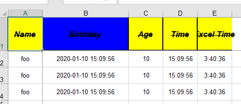

# Easy Excel
> 通过简单注解使用 apache POI 快速导出 Excel 文件

## 开始

### 要求

* Java 8+ 

### 1. 添加依赖

```xml
<dependency>
    <groupId>io.github.xinshepherd</groupId>
    <artifactId>easy-excel</artifactId>
    <version>1.2.0</version>
</dependency>
```

### 2. 示例

*如果你的应用是使用Spring Boot搭建，可以参考这个例子 [spring-boot-demo](https://github.com/XinShepherd/easy-excel-examples)* 

首先, 定义一个实体类.

```java

@Data
@Excel(value = "Summary", headerColor = 0x0D, herderHigh = 1024, rowHigh = 512, fontStyle = CustomFontStyle.class)
public class Model {

    @ExcelField("Name")
    private String name;

    @ExcelField(value = "Birthday", type = DATE, width = 50, headerColor = 0x0C)
    private Date birthDate;

    @ExcelField(value = "Age", type = NUMERIC)
    private Integer age;

    @ExcelField(value = "Time", type = DATE, datePattern = "h:mm:ss")
    private Date time;

    @ExcelField(value = "Excel Time", type = DATE, datePattern = "h:mm:ss")
    private double excelTime;

}
```

你可以自定义字体样式，通过覆盖这个接口的方法 `io.github.xinshepherd.excel.core.FontStyle`.
```java
public class CustomFontStyle implements FontStyle {

        @Override
        public boolean getItalic() {
            return true;
        }

        @Override
        public boolean getBold() {
            return true;
        }

        @Override
        public short getFontHeight() {
            return 256;
        }

        @Override
        public boolean getStrikeout() {
            return true;
        }
    }
```

然后将这个类 `CustomFontStyle.class` 设置到注解 `@Excel` 的 `fontStyle` 属性中.
```java
@Data
@Excel(value = "Summary", headerColor = 0x0D, herderHigh = 1024, rowHigh = 512, fontStyle = CustomFontStyle.class)
class Model {   
    //...
}
```

最后可以创建一个Junit 5测试类，如下([example](src/test/java/io/github/xinshepherd/excel/core/base/Tests.java)).

```java
import static org.assertj.core.api.AssertionsForClassTypes.assertThat;

// junit 5
public class Tests {

    @Test
    void testExport() throws IOException {
        Workbook workbook = new HSSFWorkbook();
        ExporterBase exporterBase = new DefaultExporter(workbook);
        List<Model> data = new ArrayList<>();
        Model model = new Model();
        model.setName("foo");
        model.setBirthDate(new Date());
        model.setAge(10);
        model.setTime(new Date());
        model.setExcelTime(DateUtil.convertTime("3:40:36"));
        data.add(model);
        data.add(model);
        data.add(model);
        exporterBase.appendSheet(Model.class, data);
        assertThat(workbook.getSheet("Summary")).isNotNull();
        OutputStream out = new FileOutputStream("target/foo.xls");
        workbook.write(out);
        out.close();
    }

    @Test
    @DisplayName("Same model class, different sheet name")
    void testExportMultiSheets() throws IOException {
        Workbook workbook = new HSSFWorkbook();
        ExporterBase exporterBase = new DefaultExporter(workbook);
        List<Model> data = new ArrayList<>();
        Model model = new Model();
        model.setName("foo");
        model.setBirthDate(new Date());
        model.setAge(10);
        model.setTime(new Date());
        model.setExcelTime(DateUtil.convertTime("3:40:36"));
        data.add(model);
        data.add(model);
        data.add(model);
        exporterBase.appendSheet(Model.class, data)
                .appendSheet(Model.class, data, "Summary 2");
        assertThat(workbook.getSheet("Summary")).isNotNull();
        OutputStream out = new FileOutputStream("target/foo-multi.xls");
        workbook.write(out);
        out.close();
    }
}
```

运行这个测试类，然后可以在`target` 这个目录上找到文件 `foo.xls`，示例图如下:




## TODO
- [x] **导出** Excel 特性
- [x] **增强** 导出 Excel 特性
- [ ] **导入** **Excel** 特性
